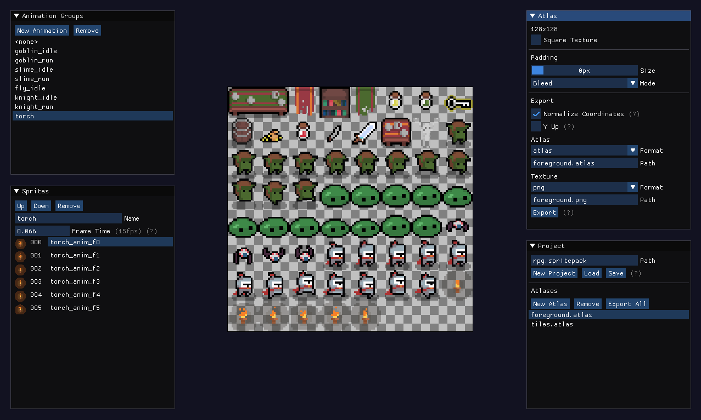

# SpritePacker

A simple texture packer for combining sprites into a single texture.



## File Format

A simple white space separated text format with single character tags (similar to [Wavefront .obj](https://en.wikipedia.org/wiki/Wavefront_.obj_file)). A json format is also available.

- A `#` Introduces a comment. There are no inline comments.
- A single `i` followed by a file path relative to the text file gives the image texture the file describes.
- An `s` tag is followed by the name of the sprite, the x and y coordinates of the sprite in the atlas, and a width and height. Depending on export options the x, y coordinates may also be normalized to be between [0.0, 1.0) or have the Y axis flipped. Sprites in the file are in the same order as they appear in the ‘Sprites’ panel.

`.atlas (normalized)`

```
i texture.tga

# tag     x        y        width      height
s tile000 0.250000 0.374512 128.000000 128.000000
s tile001 0.125000 0.374512 128.000000 128.000000
```

`.atlas (pixel coordinates)`

```
i texture.tga

# tag     x   y    w   h
s tile000 256 1280 128 128
s tile001 128 1280 128 128
```

## Building

```
mkdir build
cd build
cmake ..
make
```

On Windows cmake will generate a visual C++ solution.

## Command Line Usage

You can export multiple atlases at once by providing a `.spritepack` project file with the `--export` argument. This can be used to generate atlases automatically when building your game.

```
spritepacker -export untitled.spritepack
```
